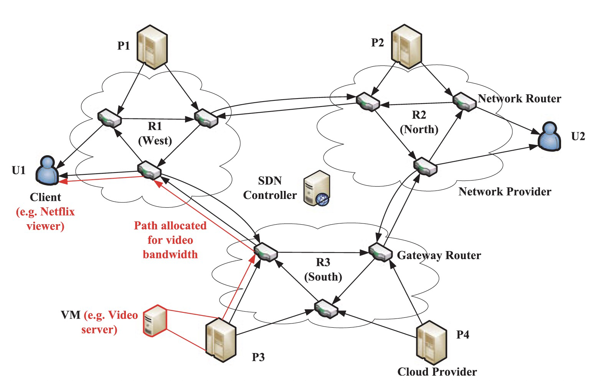
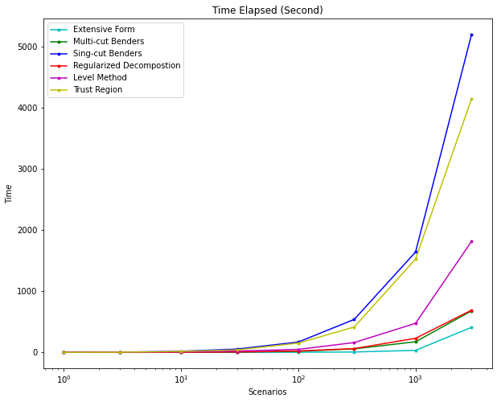
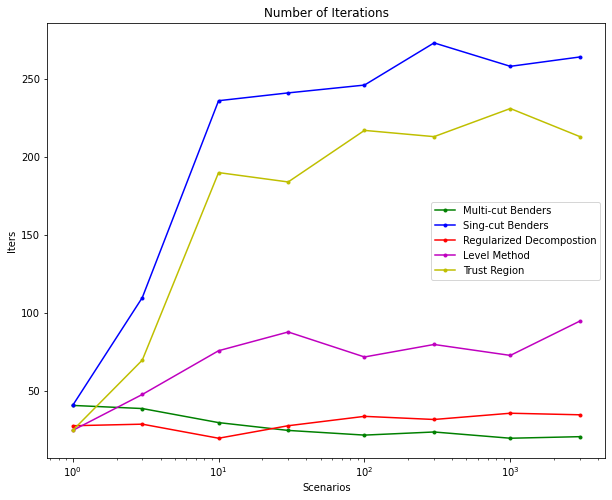

# Optimizing Costs for Cloud Computing with Stochastic Programming

 
### Introduction

Cloud computing exploits virtualization to provision resources efficiently. And the emerging of Software Defined Network (SDN) allows users to pay and custom bandwidth flow across Internet. There is a challenge for the combining of VM and bandwidth provisioning. This project allows for uncertainty of VM and bandwidth demands by formulating a two-satge stochastic optimization. And several decomposition methods are tested.

### Reference

Chase, J., & Niyato, D. (2015). Joint optimization of resource provisioning in cloud computing. IEEE Transactions on Services Computing, 10(3), 396-409.

### Dependencies

* [Python 3.7](https://www.python.org/)
* [Gurobi 9.1](https://www.gurobi.com/)

## Methods
- [Extensive From](https://github.com/LucasBoTang/Decomposition_Method_for_Two-Stage_Stochastic_Cloud_Computing_Optimization/blob/main/algo/extensiveForm.py)
- [Multi-Cut Benders](https://github.com/LucasBoTang/Decomposition_Method_for_Two-Stage_Stochastic_Cloud_Computing_Optimization/blob/main/algo/multiBenders.py)
- [Single-Cut Benders](https://github.com/LucasBoTang/Decomposition_Method_for_Two-Stage_Stochastic_Cloud_Computing_Optimization/blob/main/algo/singleBenders.py)
- [Regularized Decomposition](https://github.com/LucasBoTang/Decomposition_Method_for_Two-Stage_Stochastic_Cloud_Computing_Optimization/blob/main/algo/regularizedDecomposition.py)
- [Level Method](https://github.com/LucasBoTang/Decomposition_Method_for_Two-Stage_Stochastic_Cloud_Computing_Optimization/blob/main/algo/levelMethod.py)
- [Trust Region](https://github.com/LucasBoTang/Decomposition_Method_for_Two-Stage_Stochastic_Cloud_Computing_Optimization/blob/main/algo/trustRegion.py)

## Performance

### Time Elapse

### Iterations

